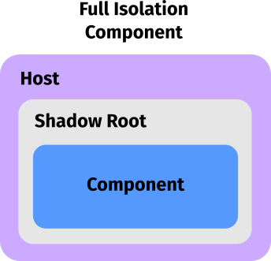

# Component Isolation

**Adapter** provides an API to entirely isolate itself inside **Shadow DOM**.
Different from other Web Component Frameworks, **Adapter** choose
another approach to be fully contained within **the Shadow DOM**.
This can simplifies CSS as there's no need to use `:host` selector
and the DOM structure will be the same whether using Shadow DOM or not.

<el-blockquote>

> 💁‍♀️ **Adapter** allows you to decide whether to use Shadow DOM
> when you utilize components in the DOM, rather than during the design
> or creation of components.
</el-blockquote>



## Example

<el-code-block>
    <div el="bar-top-left">JS</div>

```js
class ElementA extends Adapter {};
ElementA.define('el-a');
```
</el-code-block>

<el-code-block>
    <div el="bar-top-left">HTML</div>

```html
<button>Global Styled Button</button>

<el-a isolation="open">
    <button>Isolated Button</button>
</el-a>
```
</el-code-block>

### Result 
---
<button>Global Styled Button</button>

<el-a isolation="open">
    <button>Isolated Button</button>
</el-a>

---

And this is the rendered DOM for `<el-a>`


<el-blockquote>

> 💁‍♀️ For someone who curious what will happen if components are moved or removed
> from the DOM, **Adapter** will handle it for you. `host` and `component`
> will always stick together even when you move for remove the component itself.
</el-blockquote>

## Closed Shadow DOM : `<el-a isolation="closed">`
This option will create host isolator with **Closed Shadow DOM**

```html
<el-a isolation="closed">
    <button>Isolated Button</button>
</el-a>
```

### Result
---
<el-a isolation="closed">
    <button>Isolated Button</button>
</el-a>

---

This is the rendered DOM


A **Closed Shadow DOM** can prevent manipulation from other JavaScript code spaces,
such as within other `<script>` tags, for example.