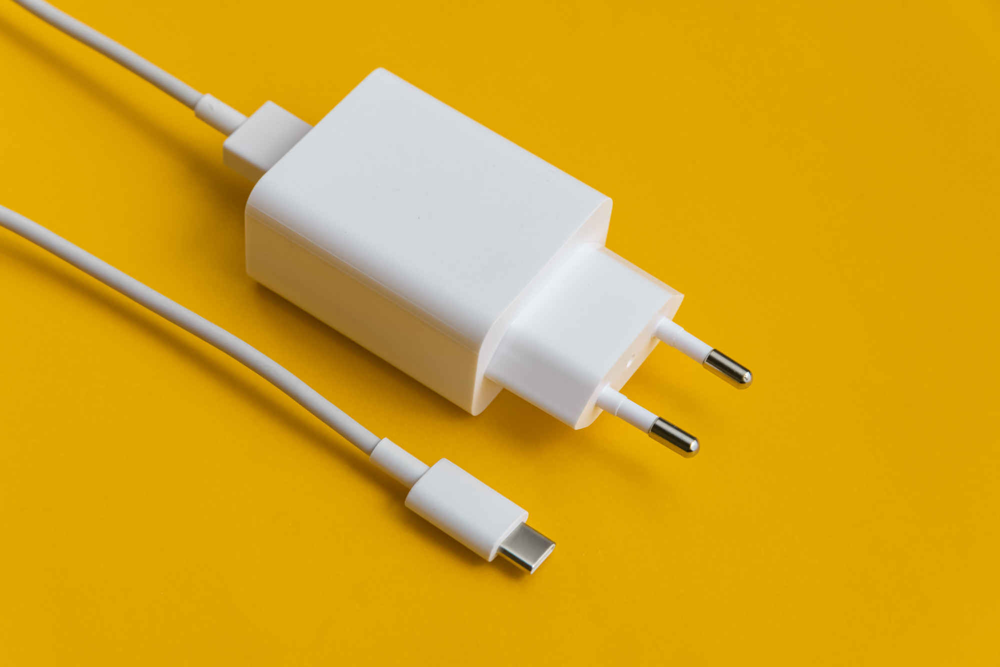

# Introduction

## What is Adapter ?
---

<div class="aspect-ratio-21-9">
    
</div>

**Adapter** is a JavaScript framework designed to seamlessly integrate
**CSS-in-JS** with **Web Components**. Setting it apart from other
**CSS** libraries, Adapter is framework which focus is on
**Web Component Styling**.

Despite its simplicity, **Adapter** unlocks endless possibilities
for enhancing UX/UI in web applications. While traditional **CSS** frameworks
have faced limitations, on the other hand, **Adapter** can implement features
such as encapsulation, inheritance, composition, event-interaction,
and other complex styling requirements which opens up new potential
for creating dynamic and feature-rich user interfaces.

## Examples
---

### OOP

```ts
import { Adapter, css } from '@devcapsule/adapter';

class FlexBox extends Adapter {
    static css = css`
        display: flex;
        justify-content: center;
    `;
}

/** WrapFlexBox also inhertit styles from FlexBox */
class WrapFlexBox extends Flexbox {
    static css = css`
        flex-wrap: wrap;
    `;
}

WrapFlexBox.define('el-wrap-flexbox');
```

This will produce CSS as

```css
el-wrap-flexbox {
    display: flex;
    justify-content: center;
    flex-wrap: wrap;
}

```

Then, you can use them in html or create an instance by javascript

<el-code-block>
<div el="bar-top-left">Javascript</div>

```js
// Create <el-flexbox> in OOP manner.
const flexBox = new FlexBox();
document.body.append(flexBox);
```
</el-code-block>

<el-code-block>
<div el="bar-top-left">HTML</div>

```html
<el-wrap-flexbox></el-wrap-flexbox>
```
</el-code-block>

<div style="margin-top: 2rem;"></div>

### Variables and Functions

<el-code-block>
<div el="bar-top-left">Javascript</div>

```ts
import Color from 'color';

function bgColor(color) {
    return css`
        background-color: ${color};
        color: ${Color(color).isDark() ? 'white' : 'black'};
    `.trim();
}

class RedFlexBox extends FlexBox {
    static css = css`${bgColor('red')}`;
}

export { bgColor, RedFlexBox };
```
</el-code-block>

<div style="margin-top: 2rem;"></div>

### Variables / Functions / OOP / Modules , That's it !

### CSS now is programmable with ES6 ! ... What else do we need ? 😉